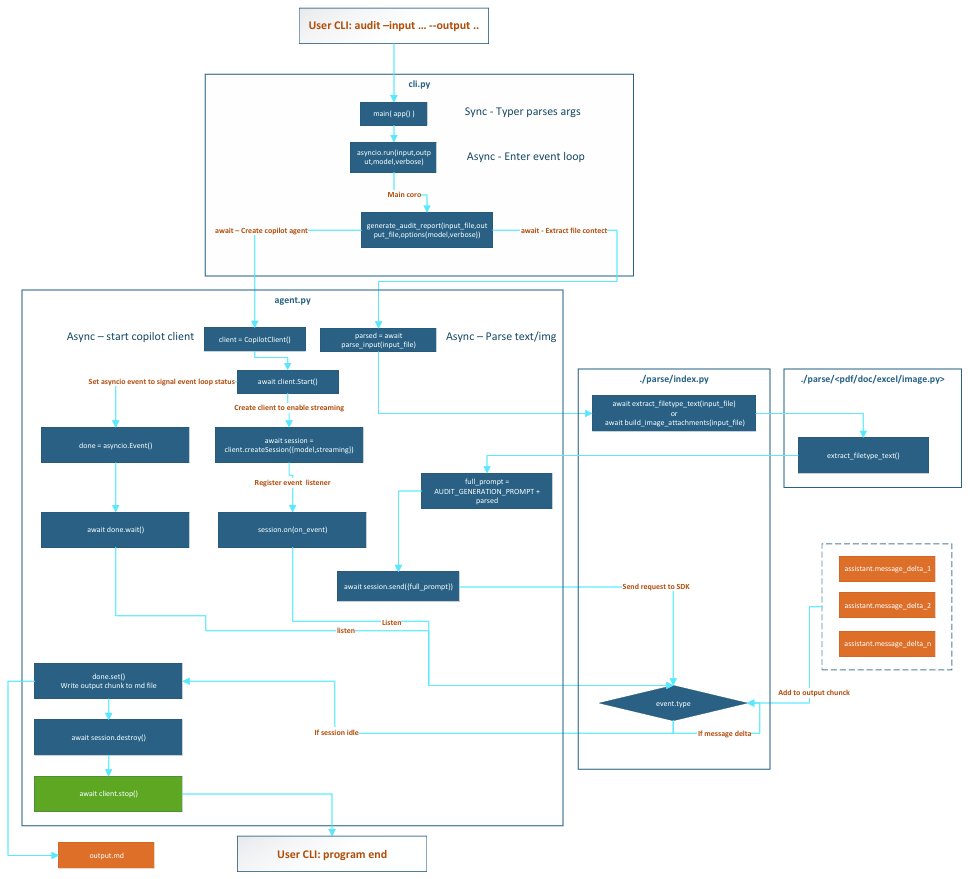

## Copilot Audit Agent Usage Guide

## Attribution

This project is **derived from**  
[CharlesKuncheria/copilot-spec-generator](https://github.com/CharlesKuncheria/copilot-spec-generator)

Original project by **Charles Kuncheria**, licensed under the MIT License.

This repository contains a **significantly modified and rewritten version**:

- Rewritten in **Python**
- Focused on **governance & audit report generation**
- Uses **GitHub Copilot Python SDK**
- Different CLI interface and execution model

---

## Important Notes (Read First)

**The Copilot Python SDK does NOT connect directly to a model.**

The SDK communicates with the Copilot runtime **through the GitHub Copilot CLI**, not by calling models directly.

👉 **You must install and log in to the Copilot CLI.**

If the CLI is unavailable or not authenticated:

- Requests may remain in `pending_messages.modified`
- `send_and_wait()` will eventually time out

---

## Install Copilot Python SDK

```bash
python -m pip install -U github-copilot-sdk
```

***

## Install GitHub Copilot CLI (Required)

```bash
winget install GitHub.Copilot
```

> ⚠️ Required  
> The SDK relies on the Copilot CLI to communicate with Copilot.

***

## Verify Copilot CLI Installation

```bash
copilot --version
```

If a version number is shown, the installation is successful.

***

## Log in to Copilot CLI

```bash
copilot
```

Then run:

```text
/login
```

Follow the on-screen instructions to authenticate your GitHub account.

***

## Local Development Installation

For local development:

```bash
python -m pip install -e .
```

***

## Usage

### Basic Usage

```bash
Shellaudit --input .\AIA_Dec23.pdf --output audit-report.md --verbose
```

***

### Parameters

* `--input` / `-i`  
  Input file path  
  Supported formats: `pdf`, `docx`, `xlsx`, `xls`, `png`, `jpg`, etc.

* `--output` / `-o`  
  Output Markdown report file path

* `--model`  
  Model name  
  Default: `gpt-5`  
  Example alternatives: `claude-sonnet-4.5`

* `--verbose` / `-v`  
  Enable verbose logging: more infor will be printed when running  
  (e.g. parsing length, session creation details)

***

### Tips

* Image inputs are automatically sent as **attachments**
* Text-based files are **parsed locally** before being sent to Copilot

***

## Report Output

The tool generates a **Markdown audit report**, typically including:

* **Executive Summary**  
  Overall assessment, strengths, and key issues

* **Document Overview**  
  Scope, version, and stakeholders

* **Process Summary**  
  As-Is process steps

* **Governance & Accountability**  
  Decision rights, responsibilities, RACI, escalation paths

* **Control Coverage Assessment**  
  Clear / Partial / Missing, with rationale

* **Findings** (evidence-based)  
  Severity, Evidence, Impact, Recommendation, Owner

* **Risks & Implications**  
  Risks, likelihood, impact, and mitigation suggestions

* **Evidence Request List**  
  Required supporting materials

* **Open Questions**  
  Items requiring clarification

* **Suggested Next Steps**  
  Action plan and follow-up recommendations

***

## Minimal Working Python Example

```python
import asyncio
from copilot import CopilotClient

async def main():
    client = CopilotClient()
    await client.start()

    session = await client.create_session({
        "model": "claude-sonnet-4.5",
        "streaming": False
    })

    resp = await session.send_and_wait({
        "prompt": "hello world"
    })
    print(resp)

    await session.destroy()
    await client.stop()

asyncio.run(main())
```

***

## Common Issues

* **`send_and_wait()` times out**
  
  * Copilot CLI is not installed
  * Not logged in (`/login`)
  * `copilot --version` does not work

* **Only `pending_messages.modified` appears**
  
  * The SDK cannot communicate with the Copilot CLI

***

## Notes

* The SDK relies entirely on the GitHub Copilot CLI
* No API keys or direct model access are required
* Authentication and subscription are managed by the CLI
  

## File Architecture

```bash
.

├─ agent.py               # Core business flow: parse → Copilot streaming → save report

├─ cli.py                 # CLI entry point: argument parsing + asyncio.run

├─ parsers/               # Document parsers (PDF / Word / Excel / Image attachments)

│  ├─ pdf.py

│  ├─ docx.py

│  ├─ excel.py

│  ├─ image.py

│  └─ index.py            # parse_input router & ParsedInput abstraction

└─ templates/

   └─ audit_prompt.py     # Audit prompt template (Markdown structure & rules)
```

## Async logic

```bash
Main coroutine (generate_audit_report)
  |
  |-- Register event listener: session.on(on_event)
  |
  |-- Send request: await session.send(...)
  |
  |-- Wait for completion: await done.wait()  <----------------------+
  |                                                                 |
  +--> (SDK continuously triggers on_event callbacks)               |
         |                                                           |
         |-- message_delta: print output + append chunk              |
         |                                                           |
         +-- session.idle: done.set()  ------------------------------+
  |
  |-- Merge chunks -> write file -> destroy session / stop client
  v
End
```


